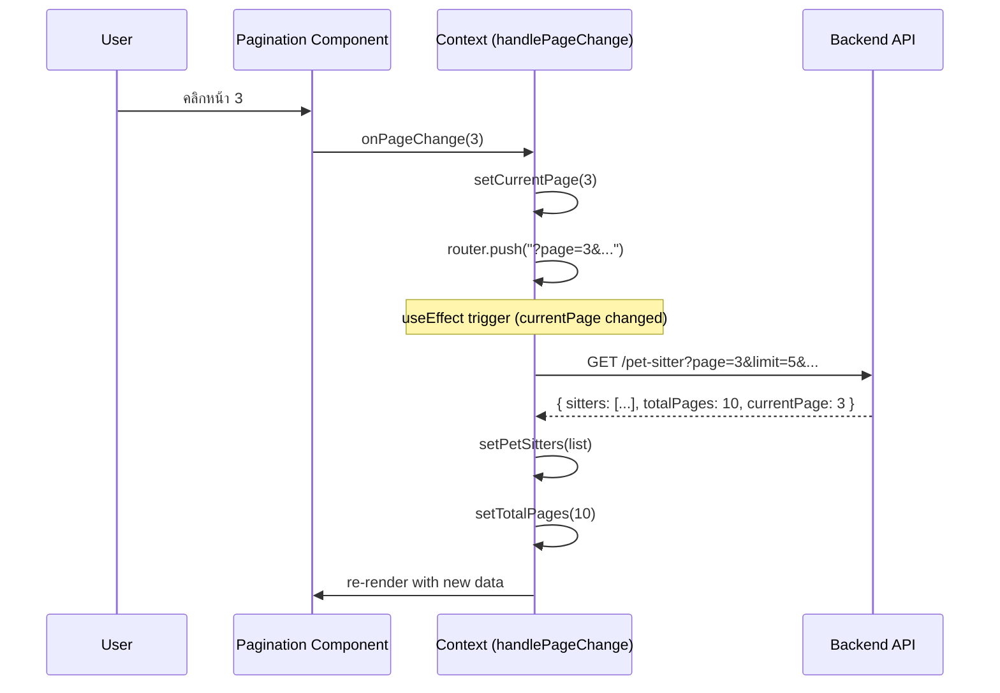
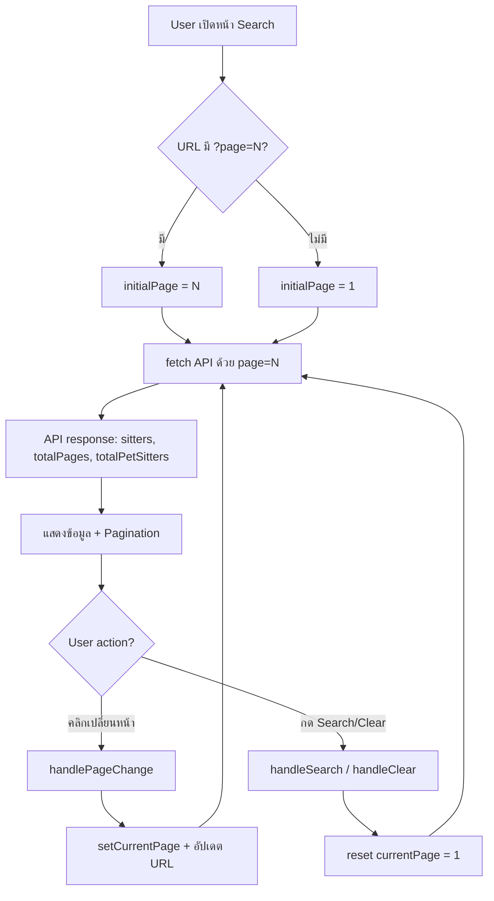

# Pagination Implementation — คำอธิบายโค้ดที่เพิ่ม

## ภาพรวม

เพิ่มระบบเปลี่ยนหน้า (Pagination) ให้ทำงานจริง โดยส่ง `page` / `limit` ไปที่ Backend API แล้วรับ `totalPages` / `currentPage` กลับมาแสดงผล

### ไฟล์ที่แก้ไข

| ไฟล์ | การเปลี่ยนแปลง |
|------|----------------|
| `PetSitterSearchContext.tsx` | เพิ่ม pagination state / API params / URL sync |
| `page.tsx` | เชื่อม `<Pagination>` กับ context |

---

## 1. การเปลี่ยนแปลงใน `PetSitterSearchContext.tsx`

### 1.1 เพิ่ม `page` key ใน PARAM_KEYS

```tsx
const PARAM_KEYS = {
  search: "search",
  petTypes: "petTypes",
  rating: "rating",
  experience: "exp",
  page: "page",        // ← เพิ่มใหม่
} as const;
```

**ทำไม:** เพื่อ sync ค่าหน้าปัจจุบันกับ URL → ทำให้ user แชร์ลิงก์ที่รวมหน้าที่กำลังดูได้

### 1.2 เพิ่ม Pagination Constants

```tsx
const DEFAULT_PAGE = 1;
const DEFAULT_LIMIT = 5;
```

**ทำไม:** กำหนดค่า default ไว้ที่เดียว ถ้าต้องการเปลี่ยนจำนวนรายการต่อหน้า แก้ที่ `DEFAULT_LIMIT` จุดเดียว

### 1.3 เพิ่ม Pagination State (3 ตัว)

```tsx
// อ่านค่าเริ่มต้นจาก URL (?page=3 → เริ่มที่หน้า 3)
const initialPage = (() => {
  const p = new URLSearchParams(searchParams?.toString() ?? "")
    .get(PARAM_KEYS.page);
  return p ? Math.max(1, Number(p)) : DEFAULT_PAGE;
})();

const [currentPage, setCurrentPage] = useState(initialPage);
const [totalPages, setTotalPages]   = useState(1);
const [totalPetSitters, setTotalPetSitters] = useState(0);
```

| State | หน้าที่ | ค่าเริ่มต้น |
|-------|--------|-------------|
| `currentPage` | หน้าที่กำลังแสดง | อ่านจาก URL หรือ 1 |
| `totalPages` | จำนวนหน้าทั้งหมด (จาก API) | 1 |
| `totalPetSitters` | จำนวน pet sitter ทั้งหมด (จาก API) | 0 |

**`initialPage` IIFE:** ใช้ arrow function แบบ Immediately Invoked เพื่อคำนวณค่าเริ่มต้นครั้งเดียวตอน mount — ถ้า URL มี `?page=3` จะเริ่มที่หน้า 3 เลย

### 1.4 อัปเดต Fetch Logic — ส่ง `page` / `limit` ไป API

```tsx
useEffect(() => {
  // ...
  const params: Record<string, string> = {};

  // ← เพิ่มใหม่: ส่ง pagination params
  params.page  = String(currentPage);
  params.limit = String(DEFAULT_LIMIT);

  // ... (filter params เดิม)

  const response = await axios.get(
    `${process.env.NEXT_PUBLIC_API_URL}/pet-sitter`,
    { params, signal: controller.signal },
  );
  const raw = response.data;

  const list = Array.isArray(raw?.sitters) ? raw.sitters : [];
  setPetSitters(list);

  // ← เพิ่มใหม่: เก็บค่า pagination จาก response
  setTotalPages(raw.totalPages ?? 1);
  setTotalPetSitters(raw.totalPetSitters ?? 0);

  // ...
}, [appliedFilters, currentPage]); // ← เพิ่ม currentPage เป็น dependency
```

**จุดสำคัญ:**

- `currentPage` ถูกเพิ่มเป็น dependency ของ `useEffect` → เมื่อเปลี่ยนหน้า จะ fetch ข้อมูลใหม่อัตโนมัติ
- Backend API response มี `totalPages` และ `totalPetSitters` → เก็บลง state เพื่อส่งต่อให้ `<Pagination>` component

### 1.5 Reset หน้าเมื่อ Search / Clear

```tsx
const handleSearch = useCallback(() => {
  const filters = { searchText, petTypes, rating, experience };
  setCurrentPage(DEFAULT_PAGE);  // ← RESET กลับหน้า 1
  pushFiltersToURL(filters);
  setAppliedFilters(filters);
}, [...]);

const handleClear = useCallback(() => {
  // ... reset filter state ...
  setCurrentPage(DEFAULT_PAGE);  // ← RESET กลับหน้า 1
  // ...
}, [...]);
```

**ทำไม:** เมื่อ user เปลี่ยน filter แล้วกด Search ผลลัพธ์จะเปลี่ยน → ควรกลับไปหน้า 1 เสมอ ไม่งั้น user อาจอยู่ที่หน้า 5 แต่ผลลัพธ์ใหม่มีแค่ 2 หน้า

### 1.6 `handlePageChange` — Handler สำหรับเปลี่ยนหน้า

```tsx
const handlePageChange = useCallback(
  (page: number) => {
    setCurrentPage(page);            // 1) อัปเดต state → trigger re-fetch

    // 2) อัปเดต URL
    const params = new URLSearchParams(searchParams?.toString() ?? "");
    if (page <= 1) {
      params.delete(PARAM_KEYS.page); // หน้า 1 ไม่ต้องใส่ใน URL
    } else {
      params.set(PARAM_KEYS.page, String(page));
    }
    const qs = params.toString();
    router.push(qs ? `?${qs}` : "?");
  },
  [router, searchParams],
);
```

**Flow เมื่อ user คลิกเปลี่ยนหน้า:**



### 1.7 Export ผ่าน Context Value

```tsx
const value = useMemo<PetSitterSearchContextType>(() => ({
  // ... filter state/handlers เดิม ...
  currentPage,       // ← เพิ่มใหม่
  totalPages,        // ← เพิ่มใหม่
  totalPetSitters,   // ← เพิ่มใหม่
  handlePageChange,  // ← เพิ่มใหม่
  petSitters,
  isLoading,
  error,
}), [/* ... dependencies ... */]);
```

---

## 2. การเปลี่ยนแปลงใน `page.tsx`

### ปัญหาเดิม

```tsx
// ❌ ก่อนแก้ — ค่า hardcoded, ไม่เรียก API จริง
<Pagination currentPage={1} totalPages={10} />
```

`usePetSitterSearch()` ไม่สามารถเรียกใน `SearchPage` ได้ เพราะ `SearchPage` เป็นตัว render `<PetSitterSearchProvider>` เอง → hook ต้องเรียกจาก component ที่อยู่ **ภายใน** Provider

### วิธีแก้ — สร้าง Inner Component

```tsx
// ✅ สร้าง SearchPageContent อยู่ภายใน Provider → ใช้ context ได้
function SearchPageContent() {
  const { isSmall, isMedium, isLarge } = useScreenContext();
  const isWebView = isSmall && isMedium && isLarge;
  const { currentPage, totalPages, handlePageChange } = usePetSitterSearch();

  return (
    <>
      {/* ... layout เดิม ... */}
      <Pagination
        currentPage={currentPage}
        totalPages={totalPages}
        onPageChange={handlePageChange}
      />
    </>
  );
}

// SearchPage เป็นแค่ shell ที่ wrap Provider
export default function SearchPage() {
  return (
    <div className="min-h-[375px] ...">
      <Suspense fallback={<Loading />}>
        <PetSitterSearchProvider>
          <SearchPageContent />
        </PetSitterSearchProvider>
      </Suspense>
    </div>
  );
}
```

**ทำไมต้องแยก component:**

```
SearchPage (ไม่สามารถใช้ usePetSitterSearch ได้)
  └─ PetSitterSearchProvider
       └─ SearchPageContent ← ✅ ใช้ usePetSitterSearch() ได้
            └─ <Pagination currentPage={...} totalPages={...} onPageChange={...} />
```

component ที่ **render** Provider ไม่สามารถเรียก hook ของ Provider นั้นได้ ต้อง **เป็น children** ของ Provider เท่านั้น

---

## 3. สรุป Data Flow


