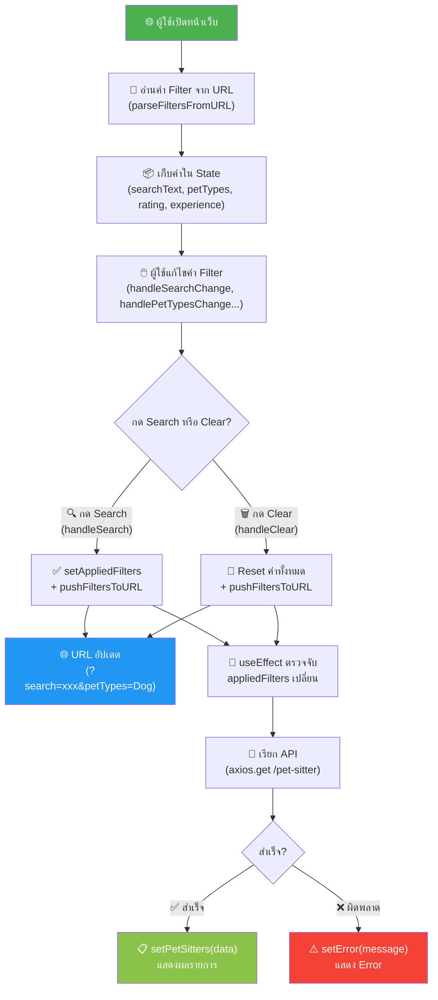
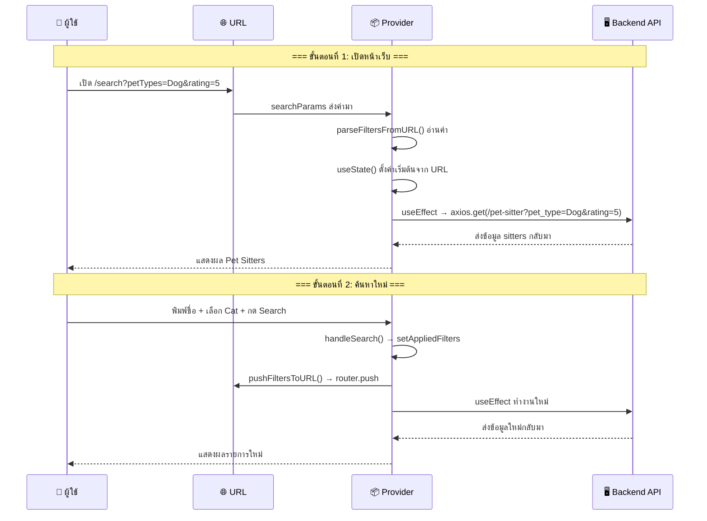
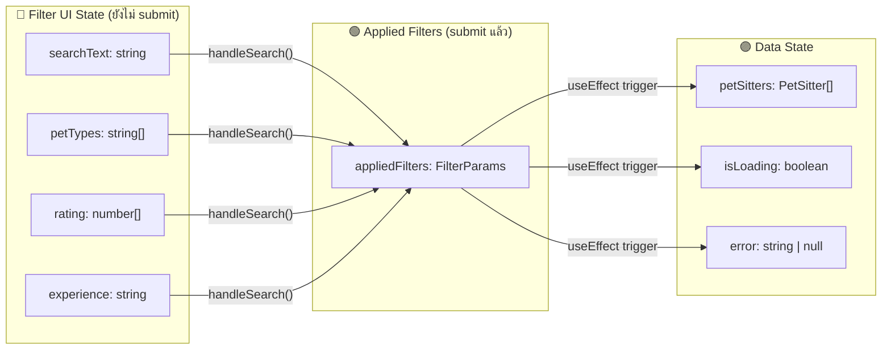
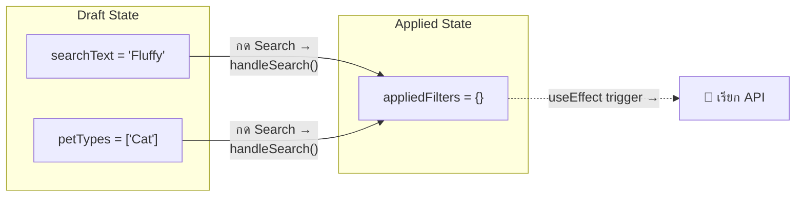
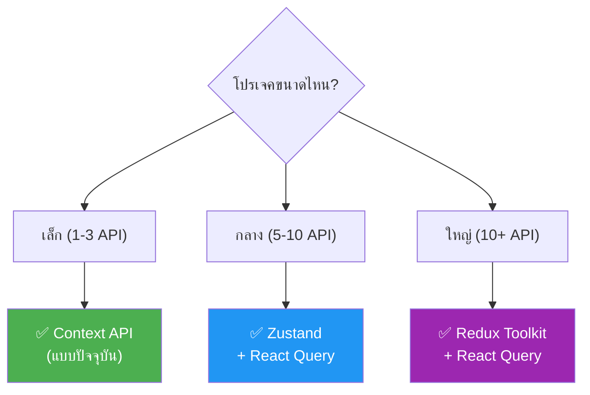

# 📖 PetSitterSearchContext.tsx — อธิบายโค้ดโดยละเอียดสำหรับมือใหม่

> **ไฟล์:** `src/contexts/PetSitterSearchContext.tsx`
> **วันที่เขียน:** 25 กุมภาพันธ์ 2026
> **วัตถุประสงค์:** เป็นศูนย์กลางจัดการ state ของ Filter ค้นหา Pet Sitter ทั้งหมด พร้อม sync กับ URL

---

## สารบัญ

1. [ภาพรวมการทำงาน (Flow Diagram)](#1-ภาพรวมการทำงาน)
2. [อธิบายโค้ดทีละส่วน](#2-อธิบายโค้ดทีละส่วน)
3. [เปรียบเทียบวิธีอื่นที่ทำได้เหมือนกัน](#3-เปรียบเทียบวิธีอื่นที่ทำได้เหมือนกัน)

---

## 1. ภาพรวมการทำงาน

### Flow Diagram หลัก: การไหลของข้อมูลในระบบ



### Flow Diagram: Lifecycle ของ Component



### Flow Diagram: โครงสร้างข้อมูล



---

## 2. อธิบายโค้ดทีละส่วน

### 2.1 — `"use client"` (บรรทัด 1)

```tsx
"use client";
```

| รายการ | รายละเอียด |
|--------|------------|
| **หน้าที่** | บอก Next.js ว่าไฟล์นี้เป็น **Client Component** |
| **ทำไมต้องใช้** | เพราะเราใช้ `useState`, `useEffect`, `useContext` ซึ่งเป็น React Hooks ที่ทำงานได้เฉพาะฝั่ง Client (Browser) เท่านั้น โดย default Next.js (App Router) จะ render component บน Server ก่อน |
| **ถ้าไม่ใส่** | จะเกิด Error: `useState` หรือ Hooks อื่นๆ ไม่สามารถใช้ใน Server Component ได้ |

---

### 2.2 — Imports (บรรทัด 3-15)

```tsx
import {
  createContext,  // สร้าง Context object
  useContext,     // ดึงค่าจาก Context
  useState,       // จัดการ state
  useEffect,      // ทำ side effect (fetch API)
  useCallback,    // จำ function ไม่ให้สร้างใหม่ทุก render
  useMemo,        // จำ value ไม่ให้คำนวณใหม่ทุก render
  type ReactNode, // Type ของ children (JSX)
} from "react";
import { useRouter, useSearchParams } from "next/navigation";
import axios from "axios";
import { PetSitter } from "@/types/PetSittersType";
import { FilterParams } from "@/types/FilterParams";
```

**อธิบายแต่ละตัว:**

| Import | มาจาก | ทำหน้าที่ |
|--------|--------|-----------|
| `createContext` | React | สร้าง "ช่องทางส่งข้อมูล" ที่ component ลูกทุกตัวเข้าถึงได้ |
| `useContext` | React | ดึงข้อมูลจาก Context ที่สร้างไว้ |
| `useState` | React | สร้าง state variable ที่เมื่อเปลี่ยนค่าแล้ว component จะ render ใหม่ |
| `useEffect` | React | ทำงานข้างเคียง (side effect) เช่น เรียก API, อ่าน URL |
| `useCallback` | React | จดจำ (memoize) function ไม่ให้ถูกสร้างใหม่ทุกครั้งที่ render |
| `useMemo` | React | จดจำ (memoize) ค่า result ไม่ให้คำนวณใหม่ทุกครั้งที่ render |
| `ReactNode` | React | Type ของ children props (ทุกอย่างที่ render ได้ เช่น JSX, string, number) |
| `useRouter` | Next.js | เข้าถึง router object เพื่อเปลี่ยน URL โดยไม่ reload หน้า |
| `useSearchParams` | Next.js | อ่าน query string จาก URL เช่น `?search=cat` |
| `axios` | axios | Library สำหรับเรียก HTTP API (GET, POST) |
| `PetSitter` | custom type | Type กำหนดรูปร่างข้อมูล Pet Sitter |
| `FilterParams` | custom type | Type กำหนดรูปร่างค่า filter |

---

### 2.3 — PARAM_KEYS Constants (บรรทัด 17-23)

```tsx
const PARAM_KEYS = {
  search: "search",
  petTypes: "petTypes",
  rating: "rating",
  experience: "exp",
} as const;
```

| รายการ | รายละเอียด |
|--------|------------|
| **หน้าที่** | เก็บชื่อ key ที่จะใช้ใน URL query string ไว้ที่เดียว |
| **ทำไมต้องใช้** | ป้องกันการพิมพ์ผิด (typo) — ถ้าเขียน `"serch"` แทน `"search"` ที่ 5 จุด จะหา bug ยากมาก แต่ถ้าใช้ `PARAM_KEYS.search` แล้วพิมพ์ผิด TypeScript จะฟ้อง error ทันที |
| **`as const`** | บอก TypeScript ว่าค่าเหล่านี้เป็น literal type เช่น `"search"` ไม่ใช่แค่ `string` ทั่วไป ทำให้ type checking เข้มงวดขึ้น |

> **เปรียบเทียบ:** ถ้าไม่ใช้ constant นี้ ทุกที่ในโค้ดจะเขียนตรงๆ เช่น `searchParams.get("search")`, `params.set("search", ...)` — เมื่อต้องเปลี่ยนชื่อ key จะต้องแก้ทุกจุดด้วยตัวเอง

---

### 2.4 — DEFAULT_EXPERIENCE (บรรทัด 26)

```tsx
const DEFAULT_EXPERIENCE = "0-3 Years";
```

ค่าเริ่มต้นของ filter ประสบการณ์ แยกออกมาเป็น constant เพื่อใช้ซ้ำในหลายจุด (ตอน `useState` และ `handleClear`)

---

### 2.5 — parseFiltersFromURL (บรรทัด 29-45)

```tsx
function parseFiltersFromURL(searchParams: URLSearchParams): FilterParams {
  const filters: FilterParams = {};

  // อ่าน search text จาก URL: ?search=xxx
  const search = searchParams.get(PARAM_KEYS.search);
  if (search) filters.searchText = search;

  // อ่าน petTypes จาก URL: ?petTypes=Dog,Cat → แปลงเป็น ["Dog", "Cat"]
  const petTypes = searchParams.get(PARAM_KEYS.petTypes);
  if (petTypes) filters.petTypes = petTypes.split(",");

  // อ่าน rating จาก URL: ?rating=4,5 → แปลงเป็น [4, 5]
  const rating = searchParams.get(PARAM_KEYS.rating);
  if (rating) filters.rating = rating.split(",").map(Number);

  // อ่าน experience จาก URL: ?exp=3-5 Years
  const exp = searchParams.get(PARAM_KEYS.experience);
  if (exp) filters.experience = exp;

  return filters;
}
```

| รายการ | รายละเอียด |
|--------|------------|
| **หน้าที่** | แปลง URL query string → `FilterParams` object |
| **ทำไมแยก function** | เพราะเป็น Pure Function (ไม่แก้ไข state ตรงๆ) ทำให้ test ง่าย reuse ได้ แยกออกจาก component logic |
| **`split(",").map(Number)`** | URL เก็บได้แค่ string ดังนั้น `"4,5"` ต้อง split เป็น `["4","5"]` แล้ว map เป็น `[4, 5]` |
| **เช็ค `if (search)`** | ถ้า URL ไม่มี key นั้น `.get()` จะ return `null` — เราข้ามไปไม่เพิ่มเข้า filter |

---

### 2.6 — Context Type (บรรทัด 48-73)

```tsx
interface PetSitterSearchContextType {
  // === ค่า Filter ที่ผู้ใช้กำลังแก้ไขอยู่ (ยังไม่กดค้นหา) ===
  searchText: string;       // คำค้นหา
  petTypes: string[];       // ประเภทสัตว์ เช่น ["Dog", "Cat"]
  rating: number[];         // คะแนน เช่น [4, 5]
  experience: string;       // ประสบการณ์ เช่น "0-3 Years"

  // === ฟังก์ชันเปลี่ยนค่า Filter ===
  handleSearchChange: (value: string) => void;
  handlePetTypesChange: (value: string[]) => void;
  handleRatingChange: (value: number[]) => void;
  handleExperienceChange: (value: string) => void;

  // === Actions ===
  handleSearch: () => void;  // กดค้นหา → submit filters + fetch
  handleClear: () => void;   // กดล้าง → reset filters + fetch

  // === ข้อมูลจาก API ===
  petSitters: PetSitter[];   // รายการ Pet Sitter
  isLoading: boolean;        // กำลังโหลดอยู่ไหม
  error: string | null;      // ข้อความ error (ถ้ามี)
}
```

| รายการ | รายละเอียด |
|--------|------------|
| **หน้าที่** | กำหนด "สัญญา" (contract) ว่า Context นี้จะส่งค่าอะไรให้ component ลูกบ้าง |
| **ทำไมต้อง interface** | TypeScript จะตรวจสอบให้ว่า Provider จัดเตรียมค่าครบทุกตัว และ consumer เรียกใช้ถูก type |

---

### 2.7 — สร้าง Context (บรรทัด 71-73)

```tsx
const PetSitterSearchContext = createContext<PetSitterSearchContextType | null>(
  null,
);
```

| รายการ | รายละเอียด |
|--------|------------|
| **หน้าที่** | สร้าง Context object ที่ component ลูกจะดึงค่าจาก |
| **ค่าเริ่มต้น `null`** | ถ้า component เรียก `useContext` โดยไม่ได้อยู่ใน Provider → จะได้ `null` → custom hook จะ throw Error แจ้งเตือน |
| **`| null`** | บอก TypeScript ว่าค่าอาจเป็น `null` ได้ (ก่อนที่ Provider จะ provide ค่าจริง) |

---

### 2.8 — Provider Component (บรรทัด 76-265)

นี่คือหัวใจหลักของไฟล์นี้ แบ่งออกเป็นหลายส่วนย่อย:

#### 2.8.1 — ลายเซ็น + ดึง Router/SearchParams (บรรทัด 76-80)

```tsx
export function PetSitterSearchProvider({
  children,
}: Readonly<{ children: ReactNode }>) {
  const router = useRouter();
  const searchParams = useSearchParams();
```

| รายการ | รายละเอียด |
|--------|------------|
| `children` | สิ่งที่ถูก wrap อยู่ข้างใน `<PetSitterSearchProvider>...</PetSitterSearchProvider>` |
| `Readonly<>` | ป้องกันไม่ให้แก้ไข props object โดยตรง (best practice) |
| `useRouter()` | ได้ router object สำหรับ `router.push()` เปลี่ยน URL |
| `useSearchParams()` | ได้ค่า query string ปัจจุบัน เช่น `?search=cat` |

#### 2.8.2 — อ่านค่าเริ่มต้นจาก URL (บรรทัด 83-88)

```tsx
const initialFilters = useMemo(
  () => parseFiltersFromURL(new URLSearchParams(searchParams?.toString() ?? "")),
  [], // Only run on mount — ไม่สนว่า searchParams จะเปลี่ยนทีหลัง
);
```

| รายการ | รายละเอียด |
|--------|------------|
| **หน้าที่** | อ่านค่า filter จาก URL **ครั้งเดียวตอนเปิดหน้าเว็บ** |
| **ทำไมใช้ `useMemo`** | `useMemo` กับ `[]` จะคำนวณค่าแค่ครั้งเดียวตอน mount — ไม่คำนวณใหม่ทุก render |
| **`searchParams?.toString() ?? ""`** | ป้องกัน `null` — ถ้า searchParams เป็น null ให้ใช้ string ว่างแทน |
| **eslint-disable** | เพราะ eslint อาจบอกว่าควรใส่ `searchParams` ใน dependency — แต่เราจงใจไม่ใส่เพราะต้องการอ่านแค่ตอน mount |

#### 2.8.3 — Filter UI State (บรรทัด 91-98)

```tsx
const [searchText, setSearchText] = useState(initialFilters.searchText ?? "");
const [petTypes, setPetTypes] = useState<string[]>(initialFilters.petTypes ?? []);
const [rating, setRating] = useState<number[]>(initialFilters.rating ?? []);
const [experience, setExperience] = useState(initialFilters.experience ?? DEFAULT_EXPERIENCE);
```

| รายการ | รายละเอียด |
|--------|------------|
| **หน้าที่** | เก็บค่าที่ผู้ใช้กำลังแก้ไขใน Filter form (ยังไม่ submit) |
| **`initialFilters.xxx ?? defaultValue`** | ถ้า URL มีค่า → ใช้ค่าจาก URL, ถ้าไม่มี → ใช้ค่าเริ่มต้น |
| **ทำไมแยก state ทีละตัว** | แต่ละ filter มี type ต่างกัน (string, string[], number[]) — แยกกันทำให้ type safe และ update ง่าย |

> **หมายเหตุ:** state เหล่านี้เป็น **"Draft"** — ผู้ใช้พิมพ์หรือเลือกอะไร ค่าจะเปลี่ยนทันที แต่ API จะยังไม่ถูกเรียกจนกว่าจะกด Search

#### 2.8.4 — Applied Filters State (บรรทัด 101-102)

```tsx
const [appliedFilters, setAppliedFilters] = useState<FilterParams>(initialFilters);
```

| รายการ | รายละเอียด |
|--------|------------|
| **หน้าที่** | เก็บค่า filter ที่ถูก "ยืนยัน" แล้ว (กด Search แล้ว) |
| **ทำไมแยกจาก UI state** | เพื่อไม่ให้ API ถูกเรียกทุกครั้งที่ผู้ใช้พิมพ์ตัวอักษร — API จะเรียกเฉพาะเมื่อ `appliedFilters` เปลี่ยน |



#### 2.8.5 — Data Fetching State (บรรทัด 105-107)

```tsx
const [petSitters, setPetSitters] = useState<PetSitter[]>([]);
const [isLoading, setIsLoading] = useState(false);
const [error, setError] = useState<string | null>(null);
```

3 state ที่จัดการผลลัพธ์จาก API:

| State | Type | ค่าเริ่มต้น | หน้าที่ |
|-------|------|-------------|---------|
| `petSitters` | `PetSitter[]` | `[]` | เก็บรายการ Pet Sitter ที่ได้จาก API |
| `isLoading` | `boolean` | `false` | บอกว่ากำลังโหลดอยู่ไหม (ใช้แสดง spinner) |
| `error` | `string \| null` | `null` | ข้อความ error (null = ไม่มี error) |

#### 2.8.6 — useEffect: Fetch API (บรรทัด 110-163) ⭐ ส่วนสำคัญ

```tsx
useEffect(() => {
  const controller = new AbortController();

  const fetchPetSitters = async () => {
    try {
      setIsLoading(true);
      setError(null);

      // สร้าง query params สำหรับส่งไป backend
      const params: Record<string, string> = {};

      if (appliedFilters.searchText) {
        params.keyword = appliedFilters.searchText;
      }
      if (appliedFilters.petTypes && appliedFilters.petTypes.length > 0) {
        params.pet_type = appliedFilters.petTypes.join(",");
      }
      if (appliedFilters.rating && appliedFilters.rating.length > 0) {
        params.rating = String(appliedFilters.rating[0]);
      }
      if (appliedFilters.experience) {
        params.experience = appliedFilters.experience
          .replace(" Years", "")
          .replace("+", "-");
      }

      const response = await axios.get(
        `${process.env.NEXT_PUBLIC_API_URL}/pet-sitter`,
        { params, signal: controller.signal },
      );
      const raw = response.data;
      const list = Array.isArray(raw?.sitters) ? raw.sitters : [];
      setPetSitters(list);

    } catch (err) {
      if (!axios.isCancel(err)) {
        console.error("Failed to fetch pet sitter data", err);
        setError("Failed to fetch pet sitter data");
      }
    } finally {
      setIsLoading(false);
    }
  };

  fetchPetSitters();

  return () => {
    controller.abort(); // ยกเลิก request ก่อนหน้าถ้ามีใหม่มา
  };
}, [appliedFilters]); // ← trigger เมื่อ appliedFilters เปลี่ยน
```

**อธิบายทีละจุดสำคัญ:**

| จุด | โค้ด | อธิบาย |
|-----|------|--------|
| **AbortController** | `new AbortController()` | สร้างตัวควบคุมสำหรับ "ยกเลิก" HTTP request — ป้องกัน race condition |
| **setIsLoading(true)** | — | เริ่มโหลด → แสดง loading spinner |
| **setError(null)** | — | ล้าง error เดิมก่อนทำ request ใหม่ |
| **สร้าง params** | `Record<string, string>` | สร้าง query params ที่ backend คาดหวัง (ชื่อ key อาจต่างจาก URL ของ frontend) |
| **`.join(",")`** | `petTypes.join(",")` | แปลง `["Dog","Cat"]` → `"Dog,Cat"` |
| **`.replace()`** | `"0-3 Years"` → `"0-3"` | แปลงข้อมูลให้ตรง format ที่ backend ต้องการ |
| **`signal: controller.signal`** | — | ถ้า `controller.abort()` ถูกเรียก → request จะถูกยกเลิกทันที |
| **`axios.isCancel(err)`** | — | ตรวจว่า error เกิดจากการยกเลิก request หรือเปล่า ถ้าใช่ → ไม่แสดง error |
| **`finally`** | `setIsLoading(false)` | ไม่ว่าสำเร็จหรือผิดพลาด → หยุด loading |
| **cleanup function** | `return () => controller.abort()` | ถ้า `appliedFilters` เปลี่ยนอีก → ยกเลิก request เดิม → ป้องกันข้อมูลเก่ามาทับใหม่ |

> **Race Condition คืออะไร?**
> สมมติผู้ใช้กด Search 2 ครั้งเร็วๆ: Request A ส่งก่อน, Request B ส่งทีหลัง
> แต่ถ้า Request B ตอบก่อน แล้ว Request A ตอบทีหลัง → ข้อมูลเก่าจาก A จะทับข้อมูลใหม่จาก B
> `AbortController` แก้ปัญหานี้โดยยกเลิก Request A เมื่อ Request B เริ่มทำงาน

#### 2.8.7 — pushFiltersToURL (บรรทัด 166-190)

```tsx
const pushFiltersToURL = useCallback(
  (filters: FilterParams) => {
    const params = new URLSearchParams(searchParams?.toString() ?? "");

    // ลบ filter keys ทั้งหมดก่อน
    Object.values(PARAM_KEYS).forEach((key) => params.delete(key));

    // เพิ่มกลับเฉพาะที่มีค่า
    if (filters.searchText) params.set(PARAM_KEYS.search, filters.searchText);
    if (filters.petTypes && filters.petTypes.length > 0)
      params.set(PARAM_KEYS.petTypes, filters.petTypes.join(","));
    if (filters.rating && filters.rating.length > 0)
      params.set(PARAM_KEYS.rating, filters.rating.join(","));
    if (filters.experience)
      params.set(PARAM_KEYS.experience, filters.experience);

    // อัปเดต URL โดยไม่ reload หน้า
    const qs = params.toString();
    router.push(qs ? `?${qs}` : "?");
  },
  [router, searchParams],
);
```

| รายการ | รายละเอียด |
|--------|------------|
| **หน้าที่** | แปลง filter state → URL query string แล้วเปลี่ยน URL |
| **ทำไมลบก่อนแล้วเพิ่มใหม่** | เพื่อไม่ให้ key ที่ถูก clear ยังค้างใน URL |
| **`router.push`** | เปลี่ยน URL โดยไม่ reload หน้า (client-side navigation) |
| **ประโยชน์ของ URL Sync** | ผู้ใช้สามารถ copy URL ส่งให้คนอื่น หรือ bookmark ได้ — เปิดมาได้ผลลัพธ์เดิม |

#### 2.8.8 — Filter Handlers (บรรทัด 193-207)

```tsx
const handleSearchChange = useCallback((value: string) => {
  setSearchText(value);
}, []);

const handlePetTypesChange = useCallback((value: string[]) => {
  setPetTypes(value);
}, []);

const handleRatingChange = useCallback((value: number[]) => {
  setRating(value);
}, []);

const handleExperienceChange = useCallback((value: string) => {
  setExperience(value);
}, []);
```

| รายการ | รายละเอียด |
|--------|------------|
| **หน้าที่** | แต่ละ function อัปเดต filter state ตัวเดียว |
| **ทำไมใช้ useCallback** | ถ้าไม่ใช้ → ทุกครั้งที่ Provider re-render, function ใหม่จะถูกสร้าง → component ลูกที่รับ function นี้เป็น prop จะ re-render โดยไม่จำเป็น |
| **dependency `[]`** | เพราะ function ไม่ขึ้นกับ state อื่น (แค่เรียก setter ของ state ตัวเอง) — `setState` ของ React มี referential stability อยู่แล้ว |

#### 2.8.9 — handleSearch & handleClear (บรรทัด 210-225)

```tsx
// กดค้นหา
const handleSearch = useCallback(() => {
  const filters: FilterParams = { searchText, petTypes, rating, experience };
  pushFiltersToURL(filters);       // อัปเดต URL
  setAppliedFilters(filters);      // trigger useEffect → fetch API
}, [searchText, petTypes, rating, experience, pushFiltersToURL]);

// กดล้างทั้งหมด
const handleClear = useCallback(() => {
  setSearchText("");
  setPetTypes([]);
  setRating([]);
  setExperience(DEFAULT_EXPERIENCE);

  const emptyFilters: FilterParams = {};
  pushFiltersToURL(emptyFilters);   // ล้าง URL
  setAppliedFilters(emptyFilters);  // trigger useEffect → fetch ใหม่ (ไม่มี filter)
}, [pushFiltersToURL]);
```

| Action | ทำอะไรบ้าง |
|--------|-------------|
| **Search** | 1. รวม filter ปัจจุบันเป็น object → 2. อัปเดต URL → 3. set applied filters → 4. useEffect เรียก API |
| **Clear** | 1. Reset ทุก state เป็นค่าเริ่มต้น → 2. ล้าง URL → 3. set applied filters เป็น `{}` → 4. useEffect เรียก API ใหม่ (ได้ข้อมูลทั้งหมด) |

#### 2.8.10 — useMemo Context Value (บรรทัด 228-259)

```tsx
const value = useMemo<PetSitterSearchContextType>(
  () => ({
    searchText, petTypes, rating, experience,
    handleSearchChange, handlePetTypesChange,
    handleRatingChange, handleExperienceChange,
    handleSearch, handleClear,
    petSitters, isLoading, error,
  }),
  [ /* ทุกค่าที่อยู่ใน object */ ],
);
```

| รายการ | รายละเอียด |
|--------|------------|
| **หน้าที่** | สร้าง value object สำหรับส่งเข้า `Provider` |
| **ทำไมใช้ useMemo** | ถ้าไม่ใช้ → ทุกครั้งที่ Provider re-render จะสร้าง object ใหม่ (reference ใหม่) → ทุก consumer จะ re-render ทั้งหมด แม้ค่าไม่เปลี่ยน |
| **dependencies** | ต้องใส่ทุกค่าที่อยู่ใน object — ถ้าค่าใดค่าหนึ่งเปลี่ยน → สร้าง object ใหม่ → consumer re-render |

#### 2.8.11 — JSX Return (บรรทัด 261-265)

```tsx
return (
  <PetSitterSearchContext.Provider value={value}>
    {children}
  </PetSitterSearchContext.Provider>
);
```

ห่อ `children` ด้วย Context Provider — ทุก component ข้างในจะเข้าถึง `value` ได้

---

### 2.9 — Custom Hook: usePetSitterSearch (บรรทัด 268-278)

```tsx
export function usePetSitterSearch() {
  const context = useContext(PetSitterSearchContext);
  if (!context) {
    throw new Error(
      "usePetSitterSearch must be used within a PetSitterSearchProvider",
    );
  }
  return context;
}
```

| รายการ | รายละเอียด |
|--------|------------|
| **หน้าที่** | ดึงค่าจาก Context แบบปลอดภัย — ถ้าลืมห่อ Provider จะ throw error แจ้งเตือนทันที |
| **ทำไมไม่ใช้ useContext ตรงๆ** | 1. ไม่ต้อง import ทั้ง `useContext` และ `PetSitterSearchContext` ทุกที่ 2. มี error handling ในตัว 3. TypeScript จะรู้ว่า return type ไม่มี `null` (เพราะ throw ไปแล้ว) |

**ตัวอย่างการใช้งาน:**

```tsx
// ✅ ถูกต้อง — ใช้ custom hook
function SearchButton() {
  const { handleSearch, isLoading } = usePetSitterSearch();
  return <button onClick={handleSearch} disabled={isLoading}>Search</button>;
}

// ❌ ลืมห่อ Provider → Error ชัดเจน
// "usePetSitterSearch must be used within a PetSitterSearchProvider"
```

---

## 3. เปรียบเทียบวิธีอื่นที่ทำได้เหมือนกัน

### 3.1 ตารางเปรียบเทียบภาพรวม

| เกณฑ์ | 🏆 Context API (ปัจจุบัน) | Redux Toolkit | Zustand | React Query + URL State |
|-------|--------------------------|---------------|---------|------------------------|
| **ความยากในการเรียนรู้** | ★★☆☆☆ ง่าย | ★★★★☆ ยาก | ★★☆☆☆ ง่าย | ★★★☆☆ ปานกลาง |
| **ขนาด Bundle** | 0 KB (built-in) | ~11 KB | ~1 KB | ~13 KB |
| **Boilerplate Code** | ปานกลาง | มาก | น้อย | น้อย |
| **Performance** | ดี (ต้อง memo เอง) | ดีมาก (selector) | ดีมาก (selector) | ดีมาก (built-in cache) |
| **DevTools** | ❌ ไม่มี | ✅ มี | ✅ มี | ✅ มี |
| **เหมาะกับโปรเจคขนาด** | เล็ก-กลาง | กลาง-ใหญ่ | เล็ก-ใหญ่ | ทุกขนาด (data fetching) |

---

### 3.2 วิธีที่ 1: Redux Toolkit

```tsx
// store/petSitterSlice.ts
import { createSlice, createAsyncThunk, PayloadAction } from '@reduxjs/toolkit';

// Async thunk สำหรับ fetch API
export const fetchPetSitters = createAsyncThunk(
  'petSitter/fetch',
  async (filters: FilterParams) => {
    const params: Record<string, string> = {};
    if (filters.searchText) params.keyword = filters.searchText;
    if (filters.petTypes?.length) params.pet_type = filters.petTypes.join(',');
    const response = await axios.get(`${API_URL}/pet-sitter`, { params });
    return response.data.sitters;
  }
);

const petSitterSlice = createSlice({
  name: 'petSitter',
  initialState: {
    searchText: '',
    petTypes: [] as string[],
    rating: [] as number[],
    experience: '0-3 Years',
    petSitters: [] as PetSitter[],
    isLoading: false,
    error: null as string | null,
  },
  reducers: {
    setSearchText: (state, action: PayloadAction<string>) => {
      state.searchText = action.payload;  // Immer ทำให้ mutate ได้ตรงๆ
    },
    setPetTypes: (state, action: PayloadAction<string[]>) => {
      state.petTypes = action.payload;
    },
    clearFilters: (state) => {
      state.searchText = '';
      state.petTypes = [];
      state.rating = [];
      state.experience = '0-3 Years';
    },
  },
  extraReducers: (builder) => {
    builder
      .addCase(fetchPetSitters.pending, (state) => { state.isLoading = true; })
      .addCase(fetchPetSitters.fulfilled, (state, action) => {
        state.isLoading = false;
        state.petSitters = action.payload;
      })
      .addCase(fetchPetSitters.rejected, (state) => {
        state.isLoading = false;
        state.error = 'Failed to fetch';
      });
  },
});
```

**ข้อดี Redux:**

- ✅ DevTools ที่ดีเยี่ยม — ดูทุก state change ได้แบบ time-travel
- ✅ Selector ช่วย performance — component เลือกดึงเฉพาะ state ที่ต้องการ ไม่ต้อง re-render ทั้งหมด
- ✅ เหมาะกับ app ขนาดใหญ่ที่มี state ซับซ้อน
- ✅ Community ใหญ่ มี middleware และ ecosystem เยอะ

**ข้อเสีย Redux:**

- ❌ Boilerplate code เยอะ (slice, thunk, store, Provider)
- ❌ ต้องเรียนรู้ concepts เพิ่ม (dispatch, reducer, selector, middleware)
- ❌ เพิ่มขนาด bundle ~11 KB
- ❌ Overkill สำหรับ app ขนาดเล็ก-กลาง

---

### 3.3 วิธีที่ 2: Zustand (แนะนำถ้าอยากเปลี่ยน)

```tsx
// store/usePetSitterStore.ts
import { create } from 'zustand';

interface PetSitterStore {
  searchText: string;
  petTypes: string[];
  rating: number[];
  experience: string;
  petSitters: PetSitter[];
  isLoading: boolean;
  error: string | null;

  setSearchText: (value: string) => void;
  setPetTypes: (value: string[]) => void;
  setRating: (value: number[]) => void;
  setExperience: (value: string) => void;
  fetchPetSitters: () => Promise<void>;
  clearFilters: () => void;
}

const usePetSitterStore = create<PetSitterStore>((set, get) => ({
  searchText: '',
  petTypes: [],
  rating: [],
  experience: '0-3 Years',
  petSitters: [],
  isLoading: false,
  error: null,

  setSearchText: (value) => set({ searchText: value }),
  setPetTypes: (value) => set({ petTypes: value }),
  setRating: (value) => set({ rating: value }),
  setExperience: (value) => set({ experience: value }),

  fetchPetSitters: async () => {
    const { searchText, petTypes, rating, experience } = get();
    set({ isLoading: true, error: null });
    try {
      const params: Record<string, string> = {};
      if (searchText) params.keyword = searchText;
      if (petTypes.length) params.pet_type = petTypes.join(',');
      if (rating.length) params.rating = String(rating[0]);

      const res = await axios.get(`${API_URL}/pet-sitter`, { params });
      set({ petSitters: res.data.sitters, isLoading: false });
    } catch {
      set({ error: 'Failed to fetch', isLoading: false });
    }
  },

  clearFilters: () => set({
    searchText: '',
    petTypes: [],
    rating: [],
    experience: '0-3 Years',
  }),
}));
```

**การใช้งานใน Component:**

```tsx
function SearchButton() {
  // ✅ ดึงเฉพาะ state ที่ต้องการ — ไม่ re-render เมื่อ state อื่นเปลี่ยน
  const isLoading = usePetSitterStore((s) => s.isLoading);
  const fetchPetSitters = usePetSitterStore((s) => s.fetchPetSitters);

  return <button onClick={fetchPetSitters} disabled={isLoading}>Search</button>;
}
```

**ข้อดี Zustand:**

- ✅ โค้ดสั้นกว่า Context มาก — ไม่ต้อง Provider, useCallback, useMemo
- ✅ Performance ดี — ใช้ selector เลือกดึงเฉพาะ state ที่ต้องการ
- ✅ ใช้ง่าย ไม่ต้องเรียนรู้ concept ใหม่
- ✅ ขนาดเล็กมาก (~1 KB)
- ✅ มี DevTools

**ข้อเสีย Zustand:**

- ❌ ต้องติดตั้ง dependency เพิ่ม
- ❌ อาจไม่คุ้นเคยสำหรับคนเริ่มต้นเรียน React ที่ยังไม่เข้าใจ Context API
- ❌ URL Sync ต้อง implement เอง (ไม่ได้มีให้ built-in)

---

### 3.4 วิธีที่ 3: React Query (TanStack Query) + URL State

```tsx
// hooks/usePetSitterQuery.ts
import { useQuery } from '@tanstack/react-query';
import { useSearchParams } from 'next/navigation';

function usePetSitterQuery() {
  const [searchParams, setSearchParams] = useSearchParams();

  // อ่าน filter จาก URL เป็น source of truth
  const filters = useMemo(() => ({
    searchText: searchParams.get('search') ?? '',
    petTypes: searchParams.get('petTypes')?.split(',') ?? [],
    rating: searchParams.get('rating')?.split(',').map(Number) ?? [],
    experience: searchParams.get('exp') ?? '0-3 Years',
  }), [searchParams]);

  // React Query จัดการ fetch, cache, loading, error ให้ทั้งหมด
  const { data, isLoading, error } = useQuery({
    queryKey: ['petSitters', filters],  // ← เมื่อ filters เปลี่ยน → fetch ใหม่
    queryFn: async () => {
      const params: Record<string, string> = {};
      if (filters.searchText) params.keyword = filters.searchText;
      if (filters.petTypes.length) params.pet_type = filters.petTypes.join(',');
      const res = await axios.get(`${API_URL}/pet-sitter`, { params });
      return res.data.sitters;
    },
    staleTime: 5 * 60 * 1000,  // cache 5 นาที — ไม่ต้อง fetch ซ้ำ
  });

  const handleSearch = useCallback((newFilters: FilterParams) => {
    const params = new URLSearchParams();
    if (newFilters.searchText) params.set('search', newFilters.searchText);
    // ... set อื่นๆ
    setSearchParams(params);
  }, [setSearchParams]);

  return { filters, petSitters: data ?? [], isLoading, error, handleSearch };
}
```

**ข้อดี React Query:**

- ✅ จัดการ loading, error, caching ให้อัตโนมัติ
- ✅ ไม่ต้องเขียน AbortController เอง
- ✅ มี cache — ถ้าผู้ใช้กลับมาค้นหาเดิม ไม่ต้อง fetch ใหม่
- ✅ มี retry, refetch on focus, background refetch
- ✅ DevTools ที่ดีเยี่ยม
- ✅ URL เป็น single source of truth

**ข้อเสีย React Query:**

- ❌ ต้องเรียนรู้ concepts ใหม่ (queryKey, staleTime, invalidation)
- ❌ เพิ่มขนาด bundle ~13 KB
- ❌ อาจเป็น overkill ถ้ามี API call ไม่กี่ตัว

---

### 3.5 สรุปคำแนะนำ



| สถานการณ์ | แนะนำ | เหตุผล |
|-----------|-------|--------|
| **เรียนรู้ React** | Context API ✅ | เข้าใจ fundamentals ก่อน |
| **โปรเจคเล็ก-กลาง** | Context API หรือ Zustand | ไม่ต้อง dependencies เยอะ |
| **ต้องการ cache + auto-refetch** | React Query | จัดการ server state ได้ดีที่สุด |
| **โปรเจคใหญ่ + team ใหญ่** | Redux Toolkit | มาตรฐาน + DevTools + predictable |

> **สรุป:** วิธี Context API ที่ใช้ในโปรเจคนี้เป็นตัวเลือกที่ **เหมาะสมที่สุด** สำหรับโปรเจคขนาดนี้ เพราะไม่ต้องติดตั้ง library เพิ่ม, เข้าใจง่าย, และจัดการ state ได้ครบถ้วน ถ้าต้องการ upgrade ในอนาคต แนะนำให้เพิ่ม **React Query** เข้ามาจัดการเรื่อง data fetching โดยเฉพาะ
